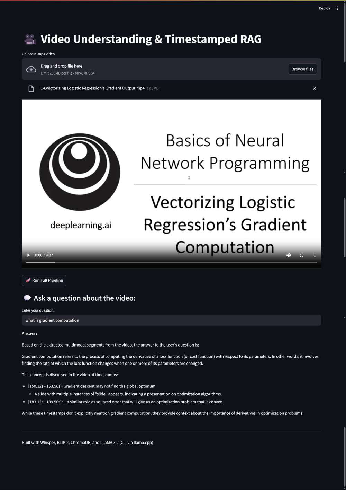

# 🎥 Video RAG Chatbot with Chroma, Whisper, BLIP-2, LLaMA 3.2, and Streamlit

A **lightweight, modular Retrieval-Augmented Generation (RAG) chatbot** that **processes videos and answers user questions based on video content**.This Video RAG Chatbot is an AI-powered video understanding agent designed to process videos and answer user questions based on the content within those videos. Unlike traditional chatbots, this system deeply understands video content by extracting audio and visual information, indexing it in a vector database, and using a powerful LLM for retrieval-augmented answering.

Built with:
- **Whisper** (audio transcription)
- **BLIP-2** (frame captioning)
- **ChromaDB** (vector storage and retrieval)
- **LLaMA 3.2 (via llama.cpp CLI)** for context-based question answering
- **Streamlit** for an interactive and clean frontend

---

## ✨ Features

✅ Upload and process videos directly from Streamlit UI  
✅ Extract **audio (Whisper)** and **frames with captions (BLIP-2)**  
✅ Embed processed content into **Chroma vector store**  
✅ Retrieve relevant chunks and generate **contextual answers with LLaMA 3.2**  
✅ Provides **timestamp frameworks** in answers to indicate **where in the video the answer relates**  
✅ Designed for **local, cost-efficient, scalable experimentation**

---

## 🖼️ Screenshots

### 📌 Streamlit Upload Interface
<!-- Upload your screenshot here -->


### 📌 Processed Output Example
<!-- Upload your screenshot here -->


### 📌 Q&A Result with Timestamps
<!-- Upload your screenshot here -->


---

## 🛠️ Tech Stack

- **Frontend**: Streamlit (Python)
- **Vector DB**: Chroma
- **Audio Transcription**: Whisper
- **Frame Captioning**: BLIP-2
- **Embedding**: Sentence Transformers / LLaMA embeddings
- **LLM for QA**: LLaMA 3.2 via llama.cpp CLI
- **File Handling**: Tempfile + Local Storage

---

## ⚙️ Workflow

1️⃣ **Video Upload**: User uploads a video via Streamlit.  
2️⃣ **Audio Extraction**: Audio extracted and transcribed using Whisper.  
3️⃣ **Frame Extraction & Captioning**: Extract frames and generate captions with BLIP-2.  
4️⃣ **Chunking & Embedding**: Split transcripts + captions into chunks, embed, and store in ChromaDB with metadata (timestamps, captions).  
5️⃣ **Query & Retrieve**: On user question, relevant video segments are retrieved from Chroma.  
6️⃣ **LLM Answer Generation**: Retrieved context passed to LLaMA 3.2 to generate a precise, timestamp-linked answer.  
7️⃣ **Answer Display**: Answer, along with reference timestamps, displayed to the user.

---

## 🚀 Running Locally

1️⃣ **Clone the repository:**

```bash
git clone https://github.com/yourusername/video-rag-chatbot.git
cd video-rag-chatbot
